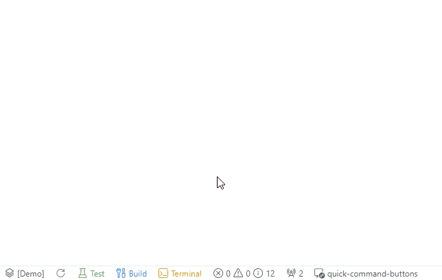
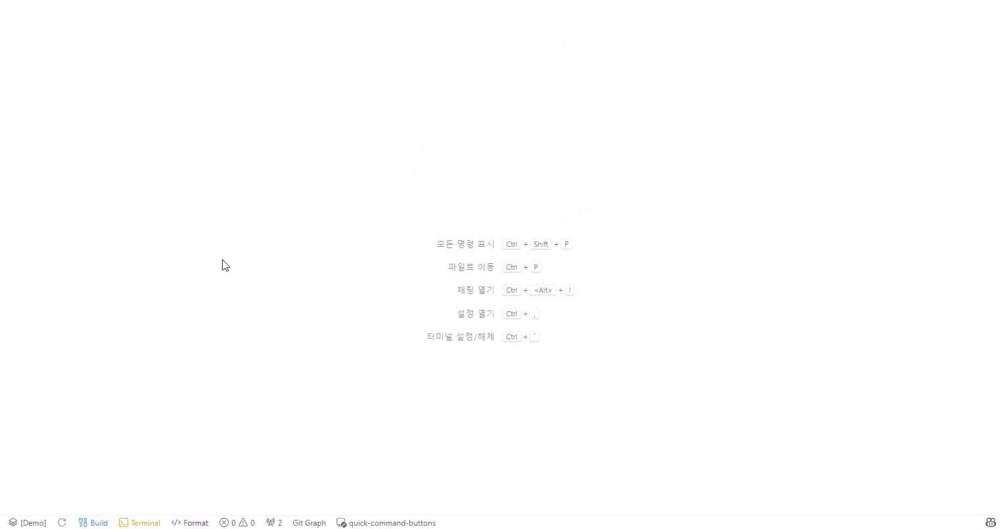

# Quick Command Buttons

<p align="center">
  <strong>타이핑은 그만. 클릭으로 실행.</strong>
</p>

<p align="center">
  
  
  
</p>

<div align="center">



_`npm test`, `git push`, `docker up` — 자주 쓰는 명령어를 버튼으로 만드세요._

[지금 설치](#-설치) · [빠른 시작 (30초)](#-빠른-시작) · [English](./README.md)

</div>

---

## 🚀 빠른 시작

**30초면 첫 버튼을 만들 수 있습니다.**

### 1. 설치 (5초)

VS Code 확장 마켓에서 "Quick Command Buttons" 검색 → 설치

### 2. 기본 버튼 사용 (5초)

상태바(하단)를 보세요. 버튼 3개가 준비되어 있습니다:

- `Test` → `npm test` 실행
- `Terminal` → 새 터미널 열기
- `Git` → Git 명령어 그룹

**클릭해보세요. 바로 작동합니다.**

### 3. 내 버튼 만들기 (20초)

1. 사이드바에서 ⚙️ 톱니바퀴 아이콘 클릭
2. "+ Add" 버튼 클릭
3. 이름: `Build`, 명령어: `npm run build`
4. 저장 → 상태바에 새 버튼 생성!

**끝! 이것만 알면 됩니다.**

---

## 🎯 핵심 기능

### 1️⃣ 버튼으로 1클릭 실행

명령어를 버튼으로 등록하고, 클릭 한 번으로 실행하세요.



- ✅ 반복 타이핑 제거
- ✅ 오타 걱정 없음
- ✅ 복잡한 명령어도 버튼 하나

<table><tr><td>
<strong>💡 Pro Tip</strong><br><br>
버튼이 너무 많아졌나요?<br>
→ <a href="#-버튼-정리하기">📦 그룹으로 정리</a>하세요<br><br>
프로젝트마다 다른 버튼이 필요하다면?<br>
→ <a href="#-버튼-세트">🚀 Button Sets</a>를 사용해보세요
</td></tr></table>

### 2️⃣ Visual UI로 쉽게 등록

JSON 편집 없이 드래그 앤 드롭으로 버튼을 관리하세요.


- ✅ 버튼 추가/삭제
- ✅ 드래그로 순서 변경
- ✅ 컬러 피커로 색상 선택
- ✅ 다크모드 지원 (VS Code 테마 연동)
- ✅ 다국어 UI (한국어 / English)

<table><tr><td>
<strong>💡 Pro Tip</strong><br><br>
Git에 안 올라가는 개인 버튼을 원한다면?<br>
→ <a href="#-local-scope--나만의-버튼">🔒 Local Scope</a> 활용하세요<br><br>
한글 키보드에서도 단축키를 쓰고 싶다면?<br>
→ <a href="#-다국어-키보드">🌐 15개 언어 지원</a>됩니다
</td></tr></table>

### 3️⃣ 어디서든 접근

세 가지 방법으로 명령어에 접근하세요. 취향대로 선택하세요.


| 방법                | 위치           | 용도                     |
| ------------------- | -------------- | ------------------------ |
| **상태바**          | 에디터 하단    | 자주 쓰는 버튼 빠른 접근 |
| **Tree View**       | 좌측 사이드바  | 전체 구조 파악 & 관리    |
| **Command Palette** | `Ctrl+Shift+;` | 키보드 중심 워크플로우   |

- ✅ 어디서든 클릭으로 실행
- ✅ Tree View에서 전체 계층 확인
- ✅ 세 곳 모두 실시간 동기화

---

## 📦 버튼 정리하기

<details>
<summary><strong>📁 그룹화 & 키보드 단축키</strong> — 클릭해서 펼치기</summary>

### 관련 명령어 그룹화

상태바를 깔끔하게 유지하세요. 관련 명령어를 그룹으로 묶으세요.


```json
{
  "name": "Git",
  "group": [
    { "name": "Pull", "command": "git pull", "shortcut": "l" },
    { "name": "Push", "command": "git push", "shortcut": "p" },
    { "name": "Status", "command": "git status", "shortcut": "s" }
  ]
}
```

**무한 중첩 지원**: 그룹 안에 그룹도 가능합니다.

### 키보드 단축키

마우스 없이 빠르게 접근하세요.

1. `g` 입력 → Git 그룹 열기
2. `p` 입력 → `git push` 실행

**번개같이 빠릅니다.**

### Tree View

사이드바에서 모든 명령어를 한눈에 보세요. (위 GIF 참조)

</details>

---

## ⚙️ 설정 범위 & 공유

<details>
<summary><strong>🔧 개인 설정 vs 팀 설정</strong> — 클릭해서 펼치기</summary>

### 세 가지 범위, 각각의 용도

| 범위             | 저장 위치             | Git 추적 | 용도                                 |
| ---------------- | --------------------- | -------- | ------------------------------------ |
| **🔒 Local**     | Workspace State       | ❌       | 개인 버튼, 실험용, DevContainer 격리 |
| **👥 Workspace** | .vscode/settings.json | ✅       | 팀 표준, 프로젝트별 명령어           |
| **🌐 Global**    | User Settings         | ❌       | 모든 프로젝트 공통 개인 명령어       |

**Fallback**: Local → Workspace → Global (비어있으면 다음 레벨로)

---

### 🔒 Local Scope — 나만의 버튼

내 버튼, 내 방식. Git에 안 올라갑니다.

**이런 경우에 좋습니다:**

- 개인 워크플로우 단축키
- 실험적인 명령어
- DevContainer별 격리된 버튼
- 공유하고 싶지 않은 버튼

---

### 👥 Workspace Scope — 팀 협업

`.vscode/settings.json`에 저장 → Git으로 추적 → 팀원들이 자동으로 받음

```json
{
  "quickCommandButtons.configurationTarget": "workspace",
  "quickCommandButtons.buttons": [
    { "name": "Setup", "command": "npm install" },
    { "name": "Dev", "command": "npm run dev" }
  ]
}
```

**신입 개발자 온보딩:**

1. 저장소 clone
2. 버튼이 자동으로 표시됨
3. 버튼 클릭으로 환경 구성 완료!

---

### Import/Export

설정을 JSON 파일로 백업하고 공유하세요.


- **Export**: 설정을 파일로 저장
- **Import 미리보기**: 적용 전 변경사항 확인
- **충돌 감지**: 단축키 충돌 경고

</details>

---

## 🚀 고급 기능

<details>
<summary><strong>⚡ 파워 유저를 위한 기능</strong> — 클릭해서 펼치기</summary>

> 기본 기능만으로도 충분히 유용합니다!
> 이 섹션은 더 깊게 활용하고 싶은 분들을 위한 것입니다.

### 🎯 버튼 세트

프로젝트나 작업 유형에 따라 **전체 버튼 구성을 전환**하세요.


**예시:**

- "Frontend" 세트: npm dev, build, test
- "Backend" 세트: docker, migrate, runserver
- "DevOps" 세트: kubectl, helm, terraform

```json
{
  "quickCommandButtons.buttonSets": [
    {
      "name": "Frontend",
      "buttons": [{ "name": "Dev", "command": "npm run dev" }]
    },
    {
      "name": "Backend",
      "buttons": [{ "name": "API", "command": "python manage.py runserver" }]
    }
  ]
}
```

**전환 방법**: Command Palette → "Switch Button Set" → 선택

---

### 🌐 다국어 키보드

한글, 일본어, 중국어 입력 상태에서도 **단축키가 그대로 작동**합니다.

**매핑 예시:**

- 한국어: `ㅅ` → `t`, `ㅎ` → `g`
- 일본어: `あ` → `a` (로마자 변환)
- 중국어: 병음 변환

**지원 언어 (15개):**
한국어, 일본어, 중국어, 러시아어, 아랍어, 히브리어, 힌디어, 독일어, 스페인어, 체코어, 그리스어, 페르시아어, 벨라루스어, 우크라이나어, 카자흐어

---

### ⚡ 동시 실행 (Execute All)

그룹의 모든 명령어를 **동시에 실행**하세요.

```json
{
  "name": "Monitor",
  "executeAll": true,
  "group": [
    { "name": "CPU", "command": "htop" },
    { "name": "Logs", "command": "tail -f app.log" },
    { "name": "Network", "command": "nethogs" }
  ]
}
```

**결과**: 터미널 3개가 동시에 열리고 각 명령어 실행

**활용 예시**: 모니터링 대시보드, 병렬 빌드, 다중 서버 실행

---

### 🔧 VS Code API 연동

터미널 명령어 대신 **VS Code 내장 명령어**도 실행 가능합니다.

```json
{
  "name": "Format",
  "command": "editor.action.formatDocument",
  "useVsCodeApi": true
}
```

**활용 예시**: 에디터 포맷팅, 파일 작업, 확장 기능 명령

</details>

---

## 🆚 왜 Quick Command Buttons인가?

| 기능              | Quick Command Buttons        | VS Code Tasks | 기타       |
| ----------------- | ---------------------------- | ------------- | ---------- |
| **1클릭 접근**    | ✅ 상태바 + Tree + Palette   | ❌ Palette만  | ⚠️ 제한적  |
| **Visual 설정**   | ✅ 드래그 앤 드롭 UI         | ❌ JSON만     | ⚠️ 기본적  |
| **무한 중첩**     | ✅ 제한 없음                 | ❌ 없음       | ⚠️ 1단계만 |
| **Button Sets**   | ✅ 컨텍스트 전환             | ❌ 없음       | ❌ 없음    |
| **다국어 키보드** | ✅ 15개 언어                 | ❌ 영어만     | ❌ 없음    |
| **팀 공유**       | ✅ Workspace + Import/Export | ⚠️ 수동       | ⚠️ 제한적  |

---

## 📦 설치

1. VS Code 열기
2. 확장 탭으로 이동 (`Ctrl+Shift+X`)
3. "Quick Command Buttons" 검색
4. Install 클릭
5. 기본 버튼 사용 또는 직접 만들기!

---

## 🎮 명령어

| 명령어                                  | 단축키         | 설명               |
| --------------------------------------- | -------------- | ------------------ |
| `Quick Commands: Show All`              | `Ctrl+Shift+;` | 통합 명령어 팔레트 |
| `Quick Commands: Open Configuration UI` | -              | Visual 설정 UI     |
| `Quick Commands: Switch Button Set`     | -              | 버튼 세트 전환     |
| `Quick Commands: Export Configuration`  | -              | 설정 내보내기      |
| `Quick Commands: Import Configuration`  | -              | 설정 가져오기      |

---

## 📖 설정 옵션

| 옵션           | 타입    | 설명                            |
| -------------- | ------- | ------------------------------- |
| `name`         | string  | 버튼 이름 (`$(icon)` 문법 지원) |
| `command`      | string  | 실행할 명령어                   |
| `useVsCodeApi` | boolean | VS Code API 사용 (터미널 대신)  |
| `color`        | string  | 버튼 색상 (hex, rgb, CSS 이름)  |
| `shortcut`     | string  | 빠른 접근용 단일 문자           |
| `terminalName` | string  | 커스텀 터미널 세션 이름         |
| `group`        | array   | 중첩 명령어 (무제한 깊이)       |
| `executeAll`   | boolean | 그룹 명령어 동시 실행           |

### 참고 자료

- [VS Code 아이콘](https://microsoft.github.io/vscode-codicons/dist/codicon.html) — `$(icon-name)` 목록
- [내장 명령어](https://code.visualstudio.com/api/references/commands) — `useVsCodeApi: true`용

---

## 🤝 기여하기

개인 프로젝트로 시작하여 환경이 맞춤화되어 있습니다.
기여를 원하시면 kubrickcode@gmail.com 으로 연락주세요.

---

## 📜 라이선스

MIT License - [LICENSE](LICENSE) 참조

---

<div align="center">

**⭐ 도움이 되셨다면 Star를 눌러주세요!**

_Made with ❤️ by [KubrickCode](https://github.com/KubrickCode)_

**타이핑은 줄이고, 클릭으로 실행하세요!**

</div>
