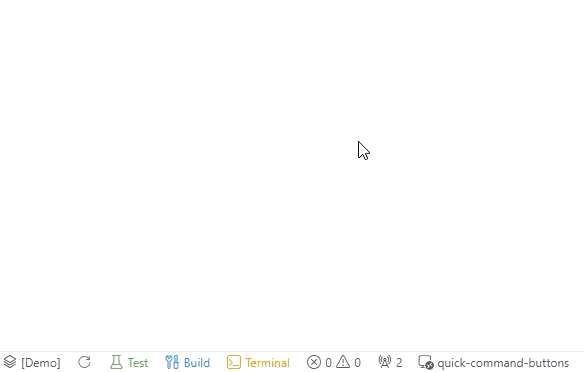
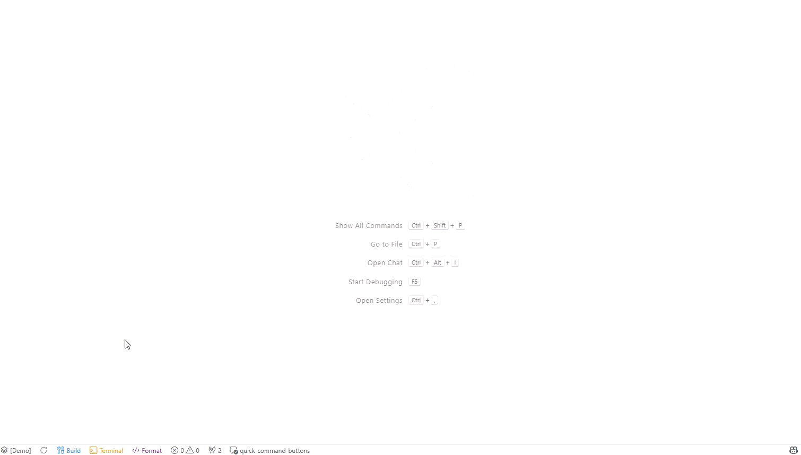

# Quick Command Buttons

<p align="center">
  <strong>Stop typing. Start clicking.</strong>
</p>

<p align="center">
  
  
  
</p>

<div align="center">



_`npm test`, `git push`, `docker up` — Turn your frequent commands into one-click buttons._

[Install Now](#-installation) · [Quick Start (30 sec)](#-quick-start) · [한국어](./README.ko.md)

</div>

---

## 🚀 Quick Start

**30 seconds to your first button.**

### 1. Install (5 sec)

Search "Quick Command Buttons" in VS Code Extensions → Install

### 2. Use default buttons (5 sec)

Look at your status bar (bottom). Three buttons are ready:

- `Test` → runs `npm test`
- `Terminal` → opens new terminal
- `Git` → git commands group

**Click one. It just works.**

### 3. Add your own button (20 sec)

1. Click ⚙️ gear icon in sidebar
2. Click "+ Add" button
3. Name: `Build`, Command: `npm run build`
4. Save → New button appears in status bar!

**That's it. You're done.**

---

## 🎯 Core Features

### 1️⃣ One-Click Execution

Register commands as buttons. Click to run. That simple.



- ✅ No more repetitive typing
- ✅ No typos ever
- ✅ Complex commands? One button.

<table><tr><td>
<strong>💡 Pro Tip</strong><br><br>
Too many buttons cluttering your status bar?<br>
→ Organize with <a href="#-organize-your-buttons">📦 Grouping</a><br><br>
Different projects need different buttons?<br>
→ Try <a href="#-button-sets">🚀 Button Sets</a>
</td></tr></table>

### 2️⃣ Visual Configuration

No JSON editing. Just drag, drop, and click.


- ✅ Add/delete buttons visually
- ✅ Reorder with drag & drop
- ✅ Pick colors with color picker
- ✅ Dark mode support (syncs with VS Code theme)
- ✅ Multi-language UI (English / Korean)

<table><tr><td>
<strong>💡 Pro Tip</strong><br><br>
Want personal buttons that stay out of Git?<br>
→ Use <a href="#-local-scope--keep-it-personal">🔒 Local Scope</a><br><br>
Using Korean/Japanese keyboard?<br>
→ Shortcuts work in <a href="#-multi-language-keyboards">🌐 15 languages</a>
</td></tr></table>

### 3️⃣ Access Anywhere

Three ways to access your commands. Pick your style.


| Method              | Location           | Best For                  |
| ------------------- | ------------------ | ------------------------- |
| **Status Bar**      | Bottom of editor   | Quick access to favorites |
| **Tree View**       | Left sidebar panel | Overview & organization   |
| **Command Palette** | `Ctrl+Shift+;`     | Keyboard-first workflow   |

- ✅ Click to run from any location
- ✅ Tree View shows full hierarchy
- ✅ All three stay in sync

---

## 📦 Organize Your Buttons

<details>
<summary><strong>📁 Grouping & Keyboard Shortcuts</strong> — click to expand</summary>

### Group Related Commands

Keep your status bar clean. Group related commands together.


```json
{
  "name": "Git",
  "group": [
    { "name": "Pull", "command": "git pull", "shortcut": "l" },
    { "name": "Push", "command": "git push", "shortcut": "p" },
    { "name": "Status", "command": "git status", "shortcut": "s" }
  ]
}
```

**Infinite nesting**: Groups inside groups? Yes.

### Keyboard Shortcuts

Access commands without mouse.

1. Press `g` → Opens Git group
2. Press `p` → Runs `git push`

**Blazing fast.**

### Tree View

See all commands at a glance in the sidebar. (see GIF above)

</details>

---

## ⚙️ Configuration Scope & Sharing

<details>
<summary><strong>🔧 Personal vs Team Settings</strong> — click to expand</summary>

### Three Scopes for Different Needs

| Scope            | Storage               | Git Tracked | Use Case                                              |
| ---------------- | --------------------- | ----------- | ----------------------------------------------------- |
| **🔒 Local**     | Workspace State       | ❌          | Personal buttons, experiments, DevContainer isolation |
| **👥 Workspace** | .vscode/settings.json | ✅          | Team standards, project-specific commands             |
| **🌐 Global**    | User Settings         | ❌          | Personal commands across all projects                 |

**Fallback**: Local → Workspace → Global (when scope is empty)

---

### 🔒 Local Scope — Keep It Personal

Your buttons, your way. Not tracked by Git.

**Perfect for:**

- Personal workflow shortcuts
- Experimental commands
- DevContainer-specific buttons (isolated per container)
- Buttons you don't want to share

---

### 👥 Workspace Scope — Team Collaboration

Save to `.vscode/settings.json` → Git tracks it → Team gets it automatically.

```json
{
  "quickCommandButtons.configurationTarget": "workspace",
  "quickCommandButtons.buttons": [
    { "name": "Setup", "command": "npm install" },
    { "name": "Dev", "command": "npm run dev" }
  ]
}
```

**New team member onboarding:**

1. Clone repo
2. Buttons appear automatically
3. Click to set up environment!

---

### Import/Export

Backup and share configurations as JSON files.


- **Export**: Save your config to file
- **Import Preview**: Review changes before applying
- **Conflict Detection**: Warns about shortcut conflicts

</details>

---

## 🚀 Power Features

<details>
<summary><strong>⚡ For Power Users</strong> — click to expand</summary>

> The basics are already powerful!
> This section is for those who want to go deeper.

### 🎯 Button Sets

Switch your **entire button configuration** based on context.


**Example:**

- "Frontend" set: npm dev, build, test
- "Backend" set: docker, migrate, runserver
- "DevOps" set: kubectl, helm, terraform

```json
{
  "quickCommandButtons.buttonSets": [
    {
      "name": "Frontend",
      "buttons": [{ "name": "Dev", "command": "npm run dev" }]
    },
    {
      "name": "Backend",
      "buttons": [{ "name": "API", "command": "python manage.py runserver" }]
    }
  ]
}
```

**Switch**: Command Palette → "Switch Button Set" → Select

---

### 🌐 Multi-Language Keyboards

Shortcuts work even when typing in Korean, Japanese, Chinese, etc.

**Mappings:**

- Korean: `ㅅ` → `t`, `ㅎ` → `g`
- Japanese: `あ` → `a` (Romaji conversion)
- Chinese: Pinyin conversion

**15 Languages Supported:**
Korean, Japanese, Chinese, Russian, Arabic, Hebrew, Hindi, German, Spanish, Czech, Greek, Persian, Belarusian, Ukrainian, Kazakh

---

### ⚡ Execute All

Run **all commands in a group simultaneously**.

```json
{
  "name": "Monitor",
  "executeAll": true,
  "group": [
    { "name": "CPU", "command": "htop" },
    { "name": "Logs", "command": "tail -f app.log" },
    { "name": "Network", "command": "nethogs" }
  ]
}
```

**Result**: 3 terminals open, all commands running

**Use cases**: Monitoring dashboard, parallel builds, multi-server startup

---

### 🔧 VS Code API Integration

Run VS Code commands, not just terminal commands.

```json
{
  "name": "Format",
  "command": "editor.action.formatDocument",
  "useVsCodeApi": true
}
```

**Use cases**: Editor formatting, file operations, extension commands

</details>

---

## 🆚 Why Quick Command Buttons?

| Feature              | Quick Command Buttons          | VS Code Tasks   | Others     |
| -------------------- | ------------------------------ | --------------- | ---------- |
| **One-Click Access** | ✅ Status bar + Tree + Palette | ❌ Palette only | ⚠️ Limited |
| **Visual Config**    | ✅ Drag & Drop UI              | ❌ JSON only    | ⚠️ Basic   |
| **Infinite Nesting** | ✅ Unlimited                   | ❌ None         | ⚠️ 1 level |
| **Button Sets**      | ✅ Context switching           | ❌ None         | ❌ None    |
| **Multi-Language**   | ✅ 15 languages                | ❌ English only | ❌ None    |
| **Team Sharing**     | ✅ Workspace + Import/Export   | ⚠️ Manual       | ⚠️ Limited |

---

## 📦 Installation

1. Open VS Code
2. Go to Extensions (`Ctrl+Shift+X`)
3. Search "Quick Command Buttons"
4. Click Install
5. Use the default buttons or create your own!

---

## 🎮 Commands

| Command                                 | Keybinding     | Description             |
| --------------------------------------- | -------------- | ----------------------- |
| `Quick Commands: Show All`              | `Ctrl+Shift+;` | Unified command palette |
| `Quick Commands: Open Configuration UI` | -              | Visual config editor    |
| `Quick Commands: Switch Button Set`     | -              | Switch button set       |
| `Quick Commands: Export Configuration`  | -              | Export to file          |
| `Quick Commands: Import Configuration`  | -              | Import from file        |

---

## 📖 Configuration Reference

| Option         | Type    | Description                              |
| -------------- | ------- | ---------------------------------------- |
| `name`         | string  | Button label (supports `$(icon)` syntax) |
| `command`      | string  | Command to execute                       |
| `useVsCodeApi` | boolean | Use VS Code API instead of terminal      |
| `color`        | string  | Button color (hex, rgb, CSS names)       |
| `shortcut`     | string  | Single character for quick access        |
| `terminalName` | string  | Custom terminal session name             |
| `group`        | array   | Nested commands (unlimited depth)        |
| `executeAll`   | boolean | Run all group commands simultaneously    |

### Helpful References

- [VS Code Icons](https://microsoft.github.io/vscode-codicons/dist/codicon.html) — `$(icon-name)` list
- [Built-in Commands](https://code.visualstudio.com/api/references/commands) — for `useVsCodeApi: true`

---

## 🤝 Contributing

This project started as a personal tool with a customized environment.
For contributions, contact kubrickcode@gmail.com.

---

## 📜 License

MIT License - see [LICENSE](LICENSE)

---

<div align="center">

**⭐ If this helps your workflow, please star the repo!**

_Made with ❤️ by [KubrickCode](https://github.com/KubrickCode)_

**Less typing. More clicking.**

</div>
