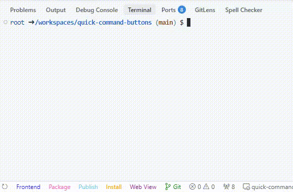
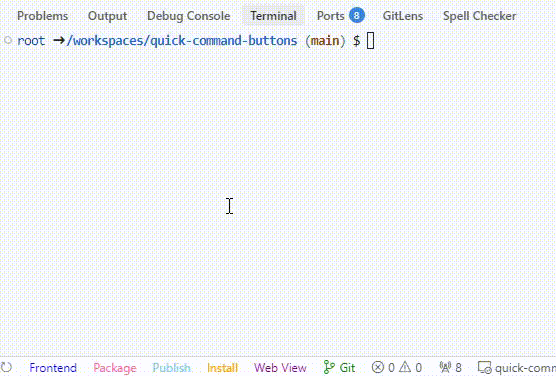
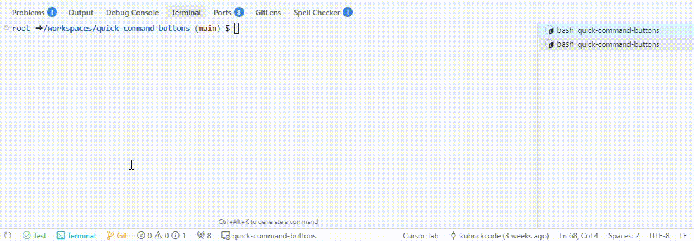
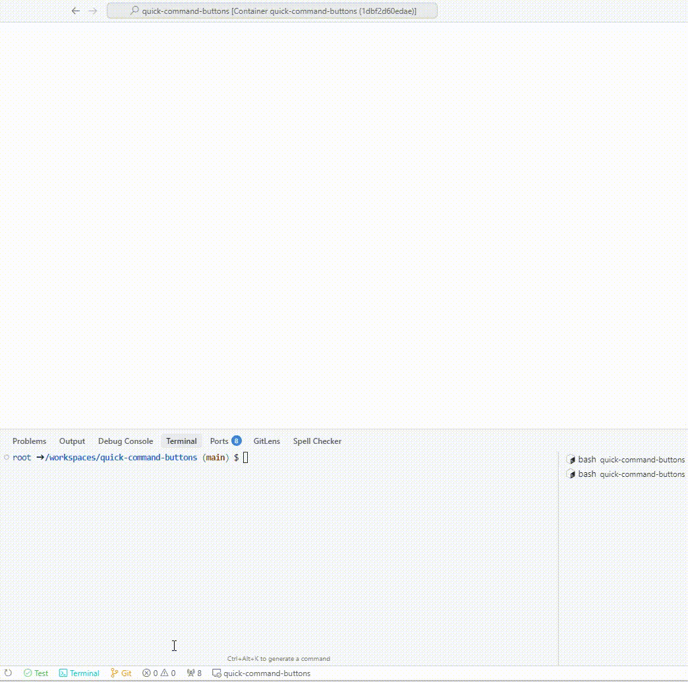
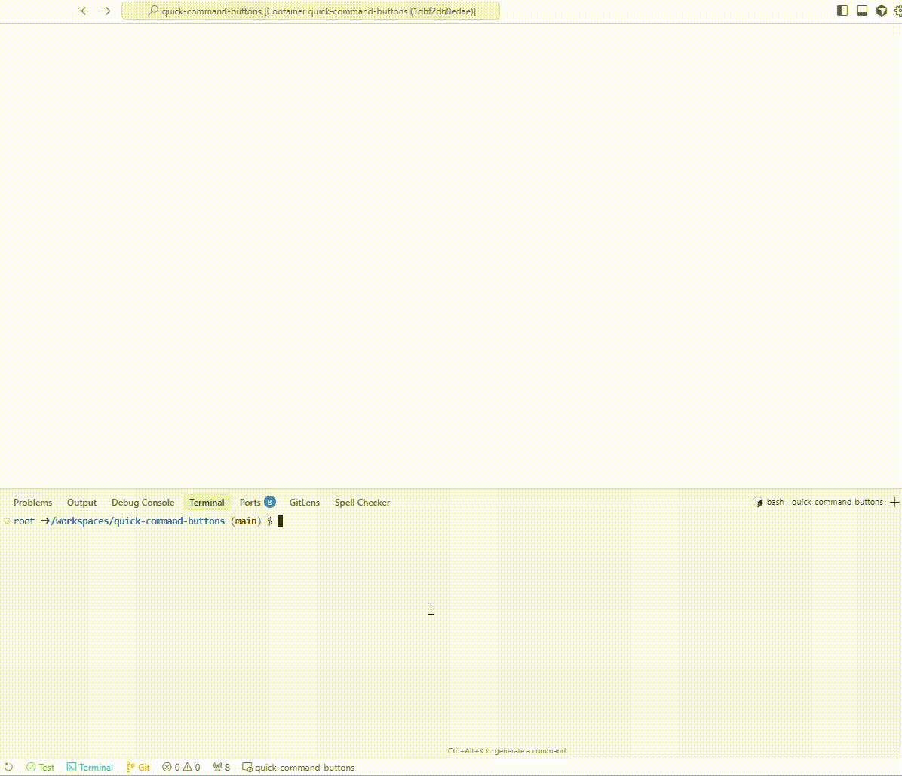
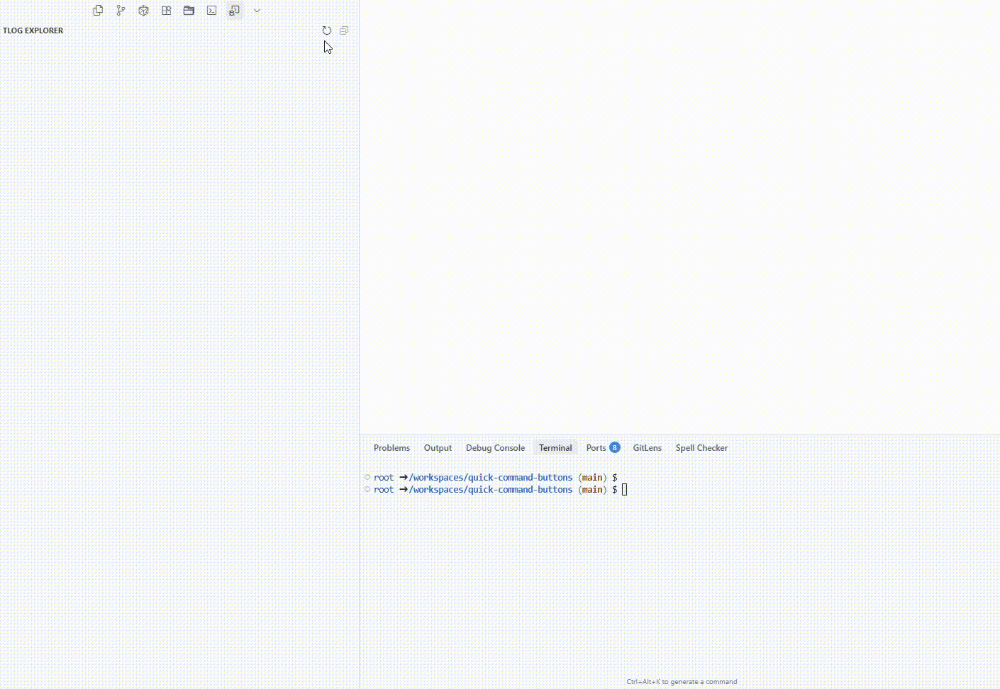

# Quick Command Buttons

<p align="center">
  <strong>Transform your VS Code workflow with customizable command buttons</strong>
</p>

<p align="center">
  
  
  
</p>

<div align="center">

## ✨ Before & After

|          Before: Plain VS Code          |      After: Quick Command Buttons      |
| :-------------------------------------: | :------------------------------------: |
|  |  |

_Stop wasting time navigating through menus. Get instant access to your most-used commands._

</div>

---

Quick Command Buttons transforms your VS Code experience by adding **smart, customizable buttons** to your status bar. Execute terminal commands, access VS Code functions, and organize complex workflows with **intelligent grouping** and **nested commands**.

## 🚀 Key Features

<div align="center">

### One-Click Command Execution



_Execute any command instantly from your status bar - no more hunting through menus_

</div>

- ⚡ **Instant Access**: Click any button to run terminal commands or VS Code functions
- 🎨 **Color-Coded**: Distinguish different command types with custom colors
- 📱 **Smart Terminals**: Each command gets its own named terminal session
- ⌨️ **Multi-Language Keyboard Shortcuts**: Use shortcuts in your native keyboard layout - Korean `ㅅ` automatically maps to English `t`, Japanese `あ` to `a`, etc. Supports 15 languages including Korean, Japanese, Chinese, Hindi, Russian, Arabic, and more

<div align="center">

### Intelligent Grouping & Nesting



_Organize related commands with unlimited nesting - perfect for complex workflows_

</div>

- 📁 **Smart Groups**: Organize related commands to save status bar space
- 🔄 **Infinite Nesting**: Create hierarchical structures with unlimited depth
- ⚡ **Quick Shortcuts**: Use single-key shortcuts for lightning-fast access

<div align="center">

### Multiple Access Methods



_Access your commands from status bar, tree view, or command palette_

</div>

- 📊 **Tree View Panel**: Visual overview of all commands in sidebar
- ⌨️ **Command Palette**: Unified interface with `Ctrl+Shift+;`
- 🎯 **Status Bar**: Direct access right in your workspace

<div align="center">

### Visual Configuration UI


_Drag-and-drop configuration with real-time preview_

</div>

- 🎨 **Visual Editor**: React-based configuration interface
- 🔄 **Drag & Drop**: Reorder commands with mouse
- ⚡ **Real-time Preview**: See changes immediately
- 💾 **Smart Saving**: Choose workspace or global settings
- 🎯 **Configuration Scope**: Team collaboration or personal use

## 🎯 Perfect For

- **🔨 Build Automation** - `npm test`, `yarn build`, deployment scripts
- **🌿 Git Workflows** - Status checks, commits, branch management
- **🐳 Docker Operations** - Container management, compose commands
- **📦 Package Management** - Install dependencies, update packages
- **🛠️ Development Tools** - Linting, formatting, custom scripts

## ⚡ Quick Start

1. **Install** the extension from VS Code Marketplace
2. **Enjoy** the default configuration with Test, Terminal, and Git commands
3. **Customize** via the visual Configuration UI or settings.json

### Basic Configuration Example

```json
{
  "quickCommandButtons.buttons": [
    {
      "name": "$(testing-passed-icon) Test",
      "command": "npm test",
      "color": "#4CAF50",
      "shortcut": "t",
      "terminalName": "Test Runner"
    },
    {
      "name": "$(terminal) Terminal",
      "command": "workbench.action.terminal.new",
      "useVsCodeApi": true,
      "color": "#00BCD4",
      "shortcut": "n"
    },
    {
      "name": "$(git-branch) Git",
      "color": "#FF9800",
      "shortcut": "g",
      "group": [
        {
          "name": "$(arrow-down) Pull",
          "command": "git pull",
          "shortcut": "l"
        },
        {
          "name": "$(arrow-up) Push",
          "command": "git push",
          "shortcut": "p"
        },
        {
          "name": "$(search) Check Status",
          "shortcut": "c",
          "group": [
            {
              "name": "$(git-commit) Status",
              "command": "git status",
              "shortcut": "s"
            },
            {
              "name": "$(diff) Diff",
              "command": "git diff",
              "shortcut": "d"
            },
            {
              "name": "$(history) Log",
              "command": "git log --oneline -5",
              "shortcut": "l"
            }
          ]
        }
      ]
    }
  ]
}
```

## 📖 Configuration Options

| Option         | Type    | Description                                     |
| -------------- | ------- | ----------------------------------------------- |
| `name`         | string  | Button display name (supports `$(icon)` syntax) |
| `command`      | string  | Command to execute                              |
| `useVsCodeApi` | boolean | Use VS Code API instead of terminal             |
| `color`        | string  | Button color (hex, rgb, or CSS names)           |
| `shortcut`     | string  | Single character for quick access               |
| `terminalName` | string  | Custom terminal session name                    |
| `group`        | array   | Nested commands (supports infinite depth)       |
| `executeAll`   | boolean | Run all group commands simultaneously           |

## ⚙️ Configuration Scope

**📁 Workspace Settings** - Share project-specific commands with your team (saved to `.vscode/settings.json`)
**🌐 Global Settings** - Personal commands available across all projects (saved to user settings)

Use `Ctrl+Shift+P` → `Toggle Configuration Target` or the button in Configuration UI to switch between scopes.

## 🎮 Usage Tips

### Keyboard Shortcuts

- **`Ctrl+Shift+;`** - Open command palette
- **Single keys** - Quick command execution in groups (e.g., press `g` then `s` for Git Status)

### Multi-Language Keyboard Support

- **🌐 Global Compatibility** - Works seamlessly with 15 keyboard layouts and input methods: Korean, Russian, Arabic, Hebrew, German, Spanish, Czech, Greek, Persian, Belarusian, Ukrainian, Kazakh, Japanese, Chinese, and Hindi
- **🔄 Auto-Translation** - Shortcuts automatically map between keyboard layouts and transliteration systems
- **⌨️ Natural Typing** - Use your native keyboard layout without switching to English
- **🎯 Smart Matching** - Type `ㅂ` on Korean keyboard to trigger `q` shortcuts, or `あ` in Japanese to match romaji equivalents
- **🇯🇵 Japanese Support** - Hiragana, Katakana, and Romaji conversion using WanaKana library
- **🇨🇳 Chinese Support** - Traditional and Simplified Chinese with Pinyin conversion
- **🇮🇳 Hindi Support** - Devanagari script with IAST transliteration support

### Pro Tips

- Use `$(icon-name)` syntax for VS Code icons in button names
- Group related commands to keep status bar clean
- Use `executeAll: true` for monitoring multiple processes
- Mix terminal commands with VS Code API calls seamlessly
- Type shortcuts in your native keyboard layout - no need to switch to English!

### 📚 Helpful References

- **📎 [VS Code Icons](https://microsoft.github.io/vscode-codicons/dist/codicon.html)** - Complete list of available `$(icon-name)` icons
- **⚙️ [Built-in Commands](https://code.visualstudio.com/api/references/commands)** - VS Code API commands for `useVsCodeApi: true`
- **🎯 [Product Icons Reference](https://code.visualstudio.com/api/references/icons-in-labels)** - Official icon syntax documentation

## 🌳 Tree View Features

<div align="center">



_Comprehensive sidebar panel for command management_

</div>

- **Hierarchical Display**: See all commands organized by groups
- **Direct Execution**: Click any command to run immediately
- **Visual Overview**: Understand your command structure at a glance

## 🔧 Advanced Features

### Multi-Command Execution

```json
{
  "name": "$(eye) System Check",
  "executeAll": true,
  "group": [
    { "name": "CPU", "command": "top -bn1 | grep load" },
    { "name": "Memory", "command": "free -h" },
    { "name": "Disk", "command": "df -h" }
  ]
}
```

### VS Code API Integration

```json
{
  "name": "$(symbol-keyword) Format",
  "command": "editor.action.formatDocument",
  "useVsCodeApi": true
}
```

### Custom Terminal Names

```json
{
  "name": "$(play) Build",
  "command": "npm run build",
  "terminalName": "Build-Process"
}
```

## 🆚 Why Choose Quick Command Buttons?

| Feature                       | Quick Command Buttons                                    | Other Extensions     |
| ----------------------------- | -------------------------------------------------------- | -------------------- |
| **Intelligent Grouping**      | ✅ Unlimited nesting                                     | ❌ Limited or none   |
| **Visual Configuration**      | ✅ Drag & drop UI                                        | ❌ Manual JSON only  |
| **Multiple Access Points**    | ✅ Status bar + Tree + Palette                           | ❌ Single method     |
| **Smart Terminal Management** | ✅ Named, organized terminals                            | ❌ Generic terminals |
| **Mixed Command Types**       | ✅ Terminal + VS Code API                                | ❌ Usually one type  |
| **Multi-Language Keyboards**  | ✅ 15 languages (Korean, Japanese, Chinese, Hindi, etc.) | ❌ English only      |
| **Real-time Updates**         | ✅ Instant configuration sync                            | ❌ Restart required  |

## 🛠️ Commands Reference

| Command                                 | Keybinding     | Description                        |
| --------------------------------------- | -------------- | ---------------------------------- |
| `Quick Commands: Show All`              | `Ctrl+Shift+;` | Open unified command palette       |
| `Quick Commands: Open Configuration UI` | -              | Launch visual configuration editor |
| `Quick Commands: Refresh Tree`          | -              | Reload tree view panel             |

## 📦 Installation

1. Open VS Code
2. Go to Extensions (`Ctrl+Shift+X`)
3. Search for "Quick Command Buttons"
4. Click Install
5. Reload VS Code
6. Start using the default commands or configure your own!

## Contributing

This project started as a small personal project with a development environment highly tailored to the owner. Given the low probability of external contributors, the current setup is unlikely to change.

If you'd like to contribute, please contact kubrickcode@gmail.com and we'll adapt the environment to accommodate contributions.

## 📜 License

MIT License - see [LICENSE](LICENSE) for details.

---

<div align="center">

**⭐ If Quick Command Buttons improves your workflow, please star the repo!**

_Made with ❤️ by [KubrickCode](https://github.com/KubrickCode)_

**Streamline your workflow, one button at a time!**

</div>
